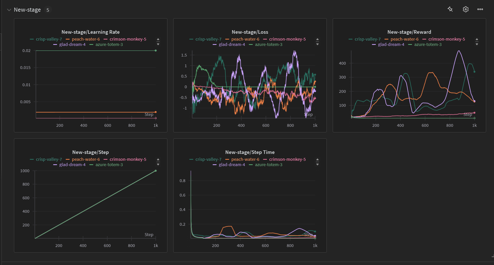

# Agent Playground

> <p><strong>机器学习概论</strong>lab4</p>
>
> <p><strong>Author:</strong>@Rosykunai</p>
>
> <p><strong>Date:</strong>2024 年 12 月</p>

这个文档是实验正文，有关实验环境配置和其它要求请查看仓库`README.md`文件

[toc]

## 0. Intro

在本次实验中你将使用强化学习训练 agent 游玩`gymnasium`库中的 MountainCar 和 CartPole 两个游戏，访问[这里]([Gymnasium Documentation (farama.org)](https://gymnasium.farama.org/)) 以了解`gymnasium`. 我们将在 1~3 节游玩 MountainCar，在第 4 节游玩 CartPole.

下面是两个游戏环境的介绍，你也可以在上面的网站中了解更多信息。

### 0.1 MountainCar

**Description**

MountainCar MDP 是一种确定性 MDP，由一辆随机放置在正弦山谷底部的小车组成，唯一可能的动作是可以沿任一方向对小车施加加速度。MDP 的目标是策略性地加速小车以到达右侧山顶的目标状态。Gymnasium 中的 MountainCar 有两个版本：一个具有离散动作，一个具有连续动作。我们使用具有离散动作的版本。

此 MDP 首次出现在 [Andrew Moore 的博士论文 (1990)](<[cl.cam.ac.uk/techreports/UCAM-CL-TR-209.pdf](https://www.cl.cam.ac.uk/techreports/UCAM-CL-TR-209.pdf)>) 中

```tex
@TECHREPORT{Moore90efficientmemory-based,
    author = {Andrew William Moore},
    title = {Efficient Memory-based Learning for Robot Control},
    institution = {University of Cambridge},
    year = {1990}
}
```

**Observation Space**

观测结果是一个 shape 为`(2,)`的`ndarray`,结构如下：
| Num | Observation | Min | Max | Unit |
| :--: | :------------: | :---: | :--: | :-----: |
| 0 | 小车的水平位置 | -1.2 | 0.6 | 位置 (x) |
| 1 | 小车的速度 | -0.07 | 0.07 | 速度 (v) |

**Action Space**

有三个离散的确定性动作：

- 0: 向左加速
- 1: 不加速
- 2: 向右加速

**Transition Dynamics**

给定动作，山地小车以下面的动力学转移：

$$\begin{align*}v_{t+1}&=v_t+(action-1)*F-\cos(3*x_t)*G \\ x_{t+1}&=x_t+v_{t+1}\end{align*}$$

其中 $F = 0.001$ and $G = 0.0025$. 两端的碰撞都是非弹性的，与墙壁碰撞时速度设置为$0$. 位置被限制在 $[-1.2, 0.6]$ 范围内，速度被限制在 $[-0.07, 0.07]$ 范围内。

**Reward**

目标是尽可能快地到达右边山顶的旗帜，因此智能体每个时间步都会受到$-1$的惩罚。在我们的实现中有一个更友好的奖励，你可以在`mdp.py`中查看。

**Starting State**

小车的初始位置是一个采样自$x_0\sim\mathbb{U}[-0.6,-0.4]$的随机值。汽车的起始速度始终被赋予$0$.

**Episode End**

出现下面两种情况时终止：

1. 终止：小车的水平位置$\ge 0.5$(到达山顶)
2. 截断：到达`time_limit`

### 0.2 [Optional] CartPole

**Description**

此环境对应于 Barto、Sutton 和 Anderson 在 [“Neuronlike Adaptive Elements That Can Solve Difficult Learning Control Problem”](https://ieeexplore.ieee.org/document/6313077)中描述的推车杆问题版本。杆通过非驱动关节连接到推车上，推车沿着无摩擦轨道移动。摆锤直立在推车上，目标是通过在推车的左右方向施加力来平衡杆。

**Observation Space**

观测结果是一个 shape 为 `(4,)` ,与速度和位置相关的`ndarray`:

| Num | Observation |         Min         |        Max        |
| :-: | :---------: | :-----------------: | :---------------: |
|  0  | 小车的位置  |        -4.8         |        4.8        |
|  1  | 小车的速度  |        -Inf         |        Inf        |
|  2  |  杆的角度   | ~ -0.418 rad (-24°) | ~ 0.418 rad (24°) |
|  3  | 杆的角速度  |        -Inf         |        Inf        |

**Note:** 虽然上述范围表示每个元素的观察空间的可能值，但它并不能反映未终止情节中状态空间的允许值。特别是：

- 小车的水平坐标 (index 0) 被限制在 `(-4.8, 4.8)`, 但是如果它超出了 `(-2.4, 2.4)` 游戏会终止。
- 杆的角度被限制在 `(-0.418, 0.418)` rad (or **±24°**), 但是如果它超出了`(-0.2095, 0.2095)` (or **±12°**) 游戏会终止。

**Action Space**

有两个离散的确定性动作：`{0, 1}` 表示推动小车的方向。

- 0: 把小车向左推
- 1: 把小车向右推

**Note**: 施加的力所减少或增加的速度不是固定的，它取决于杆指向的角度。杆的重心会改变移动其下方的推车所需的能量。

**Reward**

由于目标是尽可能长时间保持杆直立，因此默认情况下，每走一步都会获得 `+1` 的奖励，包括终止步骤。由于环境的时间限制，v1 的默认奖励阈值为 500，v0 的默认奖励阈值为 200.

如果 `sutton_barto_reward=True`，则每个非终止步骤的奖励为 `0`，终止步骤的奖励为 `-1`. 因此，v0 和 v1 的奖励阈值均为 0.

**Starting State**

所有的初始观测值都采样自$\mathbb{U}\left[-0.05,0.05\right]$.

**Episode End**

出现下面三种情况时终止：

1. 终止：杆的角度超出了 ±12°.
2. 终止：小车的水平位置超出了 ±2.4 (小车的中心到达显示器的边缘).
3. 截断：游戏时长大于 500 (200 for v0).

### 0.3 文件组织

下面是对各个文件的简要介绍，更详细的内容请参考注释，

- `utils.py`: 工具函数包
- `mdp.py`: MountainCar 的环境定义在这里
- `train.py`: 训练脚本
- `train.sh`: 训练脚本 (一个例子)
- `render.py`: 可视化环境
- `grade.py`:评分脚本
- `submission.py`:你需要修改并提交的文件

你只需要修改`submission.py`中的内容，不得修改其它文件中的内容 (它们不会被提交).

## 1. Value Iteration(15%)

在我们正式开始之前，你可以运行下面的代码熟悉大致的环境：

```bash
python render.py --agent naive-mountaincar
```

你应该能在弹出的窗口中看到一个执行随机策略的 Agent 的操作。

你将看到 Agent 陷入困境，无法在时限内完成任务。在此作业中，你将使用不同的强化学习算法训练此 Agent，以便它能够学会爬山。作为第一步，我们为这项任务离散化了整个环境。请仔细查看`mdp.py`中的`MoutainCarMDP`确保你理解了它是如何工作的。

如果我们想将 Value-Iteration 应用于 `MountainCarMDP`, 我们需要知道转移概率 $T(s,a,s′) $和奖励 $R(s,a,s′)$. 但在现实世界中，$T $和 $R$ 通常是未知的，Gymnasium 环境也是以这种方式设置的，仅通过 `.step()` 函数进行交互。一种仍然可以确定最佳策略的方法是 Model-based Value Iteration，它运行 Monte Carlo 来估计 $\hat{T}$ 和 $\hat{R}$，然后运行 Value-Iteration. 这是 Model-based RL 的一个示例。检查 `util.py `中的 `RLAlgorithm` 以了解 `getAction` 和 `incorporateFeedback` 方法，并查看函数`simulate`以理解在训练时如何反复调用它们。

(a) 完成`computeQ`函数，根据当前的$V(s)$计算$Q(s,a)$. (5 points)

(b) 完成`computePolicy`函数，根据当前的$V(s)$返回当前的策略$\pi$. (5 points)

(c) 完成`valueIteration`函数中的迭代循环，更新$V(s)$. (5 points)

提示：

- $V(s)$是一个字典`{state->value}`
- $\pi$是一个字典`{state->action}`

## 2. Model-based Monte Carlo(15%)

现在在 `submission.py` 中，实现 `ModelBasedMonteCarlo`，它在 RL Agent 运行的每个 `calcValIterEvery` 步骤中运行 `Value-Iteration`.

(a) 实现`getAction`方法，使用$\epsilon-$greedy 策略确定下一步的动作.(5 points)

(b) 实现`incorporateFeedback`方法，根据当前环境的反馈更新我们对环境的建模以及策略.(10 points)

提示：

- `succAndRewardProb`是一个字典`{(state,action)->[(nextState, transitionProb, expectedreward)]}`记录了我们对环境的建模。
- 如果在大约 500 次迭代后没有看到奖励有所改善，请仔细检查你的算法实现。

运行：

```bash
python train.py --agent value-iteration
```

以使用上面实现的 Model-based Value-Iteration 训练 Agent，并查看每次的 Reward 曲线。该命令将对三个单独的试验进行训练，因此你将获得三条不同的训练曲线。

你还可以运行

```bash
python render.py --agent value-iteration
```

以直观地观察训练后的 Agent 现在如何执行任务。上次试验的权重将被保存并用于任务。

## 3. Q-learning(10%)

在上一个问题中，我们已经看到了 Value-Iteration 如何采用描述游戏完整动态的 MDP 并返回最佳策略，我们还看到了 Model-based Value-Iteration 与 Monte Carlo 模拟如何估算最初未知的 MDP 动态，然后学习相应的最佳策略。但假设你试图控制现实世界中的复杂系统，尝试明确模拟所有可能的转换和奖励是难以解决的。我们将看到 Model-free RL 如何找到最佳策略。

对于离散化 MDP，我们有一组有限的 $(s,a)$ 对。我们使用课堂上学到的 Q-learning 更新来学习这些对的 Q 值。在 `TabularQLearning` 类中：

(a) 实现`getAction`方法，使用$\epsilon-$greedy 策略确定下一步的动作.(5 points)

(b) 实现`incorporateFeedback`方法，根据当前环境的反馈更新 Q 表.( 5points)

提示：

- 使用`getStepSize`方法获取 TD 误差的学习率。
- 如果在大约 500 次迭代后没有看到奖励有所改善，请仔细检查你的算法实现。

运行：

```bash
python train.py --agent tabular
```

以使用上面实现的`TabularQlearning`算法训练 Agent, 并查看每次的 Reward 曲线。该命令将对三个单独的试验进行训练，因此你将获得三条不同的训练曲线。

你还可以运行

```bash
python render.py --agent tabular
```

以直观地观察训练后的 Agent 现在如何执行任务。上次试验的权重将被保存并用于任务。

## 4. [Optional] Reinforce

或许你已经厌倦了山地小车和那什么价值，Q 值...(哦我的天啊！这都什么东西).

让我们换个口味，来到 Cart Pole. 这一次专注于我们的策略$\pi (a|s)$, 它的目标是给定一个输入状态$s$(在这里是一个 shape 为`(4,)`的`ndarray`),输出当前所有可能动作的概率分布$p(a|s)$(在这里是一个 shape 为`(2,)`的`ndarray`). 我们已经为你实现了一个神经网络来表示这个策略 (当然，你也可以更改它的结构，但是参数量被限制在**100K**以下),接下来我们用一种非常基础的 Policy Gradient 算法 (Reinforce) 来优化它。

**Reinforce**

给定以参数$\theta$确定的策略$\pi_{\theta}$,我们的目标是最大化整条轨迹的期望回报：

$$J(\theta)=\mathbb{E}_{\tau \sim \pi_{\theta}}R(\tau)=\sum_{\tau}P(\tau ;\theta)R(\tau)$$

其中$R(\tau)=\sum_{t=0}^T\gamma^{t}r_t$,这里$\gamma$为折扣因子，$P(\tau ;\theta)$表示以$\theta$为参数的策略执行得到轨迹$\tau$的概率，它可以被展开为：

$$P(\tau;\theta)=\prod_{t=0}^TP(s_{t+1}|s_t,a_t)\pi_{\theta}(a_t|s_t)$$

其中$P(s_{t+1}|s_t,a_t)$这一项是由环境决定的转移概率。

我们希望找到能使$J(\theta)$增大的参数更新方向，在这里我们对它求梯度，作为我们 Policy 更新方向

$$\nabla_{\theta}J(\theta)=\nabla_{\theta}\sum_{\tau}P(\tau;\theta)R(\tau)=\sum_{\tau}R(\tau)\nabla_{\theta}P(\tau;\theta)$$

考虑到上面的$P(\tau;\theta)$展开是个乘积的形式，我们很自然地想通过取对数把它变成求和，在这里我们利用$\nabla_x\log f(x)=\frac{\nabla_x f(x)}{f(x)}$引入对数。

$$\begin{align*}\sum_{\tau}R(\tau)\nabla_{\theta}P(\tau;\theta)&=\sum_{\tau}R(\tau)P(\tau;\theta)\frac{\nabla_{\theta}P(\tau;\theta)}{P(\tau;\theta)} \\ &=\sum_{\tau}R(\tau)P(\tau;\theta)\nabla_{\theta}\log P(\tau;\theta)\end{align*}$$

在这里我们可以使用 Monte Carlo 估计上面的期望，于是有：

$$\nabla_{\theta}J(\theta)=\frac{1}{m}\sum_{i=1}^mR(\tau_i)\nabla_{\theta}\log P(\tau_i;\theta)$$

考虑$\nabla_{\theta}\log P(\tau;\theta)$:

$$\begin{align*}\nabla_{\theta}\log P(\tau;\theta)&=\nabla_{\theta}\log \left[P(s_0)\prod_{t=0}^TP(s_{t+1}|s_t,a_t)\pi_{\theta}(a_t|s_t)\right] \\ &=\nabla_{\theta}\left[\log P(s_0)+\sum_{t=0}^T\log P(s_{t+1}|s_t,a_t)+\sum_{t=0}^T\log \pi_{\theta}(a_t|s_t)\right] \\ &= \nabla_{\theta}\log P(s_0)+\nabla_{\theta}\sum_{t=0}^T\log P(s_{t+1}|s_t,a_t)+\nabla_{\theta}\sum_{t=0}^T\log \pi_{\theta}(a_t|s_t) \\ &=\nabla_{\theta}\sum_{t=0}^T\log \pi_{\theta}(a_t|s_t)\end{align*}$$

最终我们对梯度的估计为：

$$\begin{align*}\nabla_{\theta}J(\theta)\approx\hat{g}=\frac{1}{m}\sum_{i=1}^m\sum_{t=0}^TR(\tau_i)\nabla_{\theta}\log \pi_{\theta}(a_{i,t}|s_{i,t})\end{align*}$$

考虑到$t$时刻之后的事件不会对之前产生影响，在下面的实现中，我们用$G(t)=\sum_{k=t}^{T-1} \gamma^{k-t}r_t$代替上面的$R(\tau)$

\*这个推导是助教在暑假期间的某次面试题。

运行：

```bash
python render --agent naive-cartpole
```

以了解 Cart Pole 游戏。

助教已经在`reinforce()`函数中实现了大致框架，接下来你需要完成这个函数

(a) 根据轨迹长度`max_t`采样一个`episode`,注意使用`max_t`来控制最大轨迹长度，而不是`env.step()`返回的`truncated`.

(b) 根据采样得到的轨迹和$G(t)=r+\gamma G(t+1)$计算$G(t)$.

(c) 计算 loss 值。

提示：

- $G(T)=0$
- 我们事实上在使用梯度累积，因此每个轨迹的 loss 需要除以 batch_size

运行：

```bash
python train.py --agent reinforce
```

以默认参数训练，你可以在`trian.py`中查看更多的超参数，`train.sh`脚本中提供了一个调整超参数的例子。

训练过程中会保存一些`checkpoint`,如果你想把某个`checkpoint`作为最终的提交结果，请在提交时把对应的文件夹更名为`final`.

提示：

- 某个`checkpoint`在训练时对应阶段的 Reward 更高并不一定性能就更好。

你还可以运行

```bash
python render.py --agent reinforce
```

以直观地观察训练后的 Agent 现在如何执行任务。上次试验的权重将被保存并用于任务。

## 5. [Optional] Tracking your experiment in wandb

同学们今后跑 ML 项目代码需要调整的超参数会越来越多，每次运行的各类成本也会越来越高。因此，充分记录实验数据是十分重要的。本小节向同学们介绍[Weights & Biases](https://wandb.ai/)用来记录你的实验。

要使用`wandb`,你需要先在上面的网站上注册一个账号，然后在网站的右上角的"?"图标里找到 Quickstart 点击进入，在第一小节点击生成你的 API Key 并复制。

确保你安装了`wandb`:

```bash
pip install wandb
```

在终端登录你的`wandb`账号：

```bash
wandb login
```

粘贴刚才复制的 API Key 以登录。

接下来你可以在训练`Policy`时传入`track`参数：

```bash
python train.py --agent reinforce --track
```

以启动`wandb`.

在默认情况下，你可以在自己的主页下找到`CartPole`项目，点击进入，即可在``Runs`中找到刚才运行的信息。



\*这只是一个例子，并不代表本次实验应当做到的结果。

`wandb`还有更多的用法，这些就留给感兴趣的同学自行探索了。

## 6. 回答问题 (20%)

- 根据输出的图片讨论与分析算法的性能，在更一般的情况下，有哪些因素会导致 Model-based Value Iteration 算法失效？(10 points)
- 填空：上面实现的`TabularQlearning`是一个\_\_\_(Model-based/Model-free),\_\_\_(Monte Carlo/Temporal Difference),\_\_\_(on-Policy/off-Policy),\_\_\_(Value-based/Policy-based),\_\_\_(on-line/off-line)RL Algorithm.(10 points)

  - online: agent 直接与环境交互，收集数据
  - offline: agent 使用收集好的数据 (可能来自其它 agent),不直接与环境交互

- [Optional] `Reinforce`算法在训练时方差很大，有没有什么办法可以减小方差？

## 7. 反馈 (1%)

**引言** 你可以写下任何反馈，包括但不限于以下几个方面：课堂、作业、助教工作等等。

**必填** 你在本次作业花费的时间大概是？(1 points)

**选填** 你可以随心吐槽课程不足的方面，或者给出合理的建议。若没有想法，直接忽略本小题即可。
